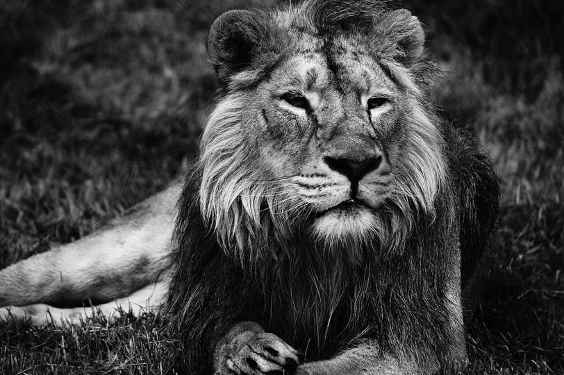
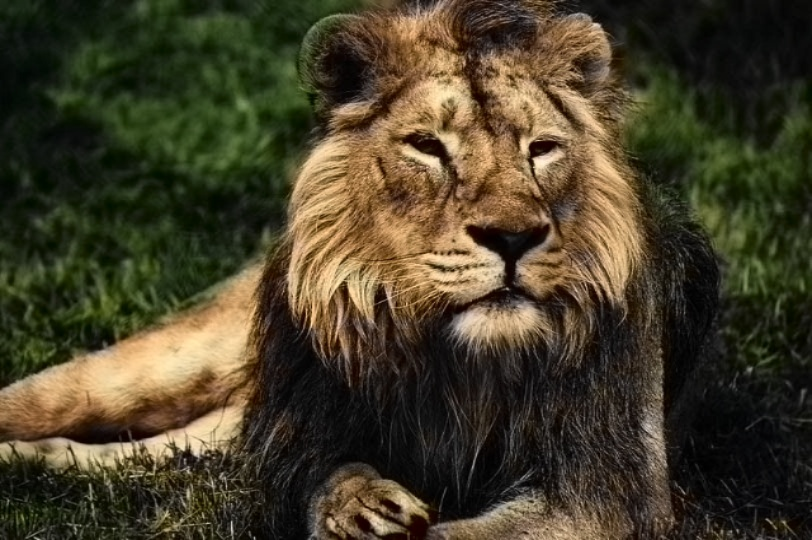
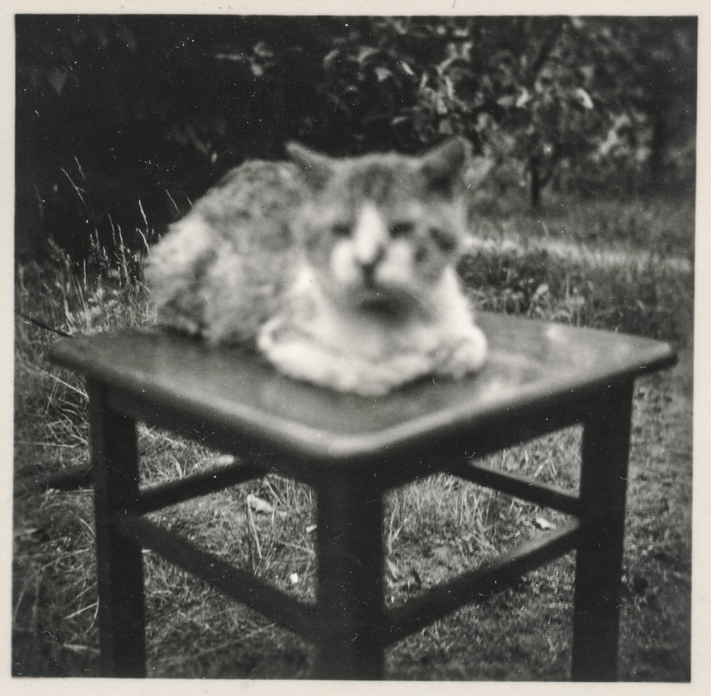
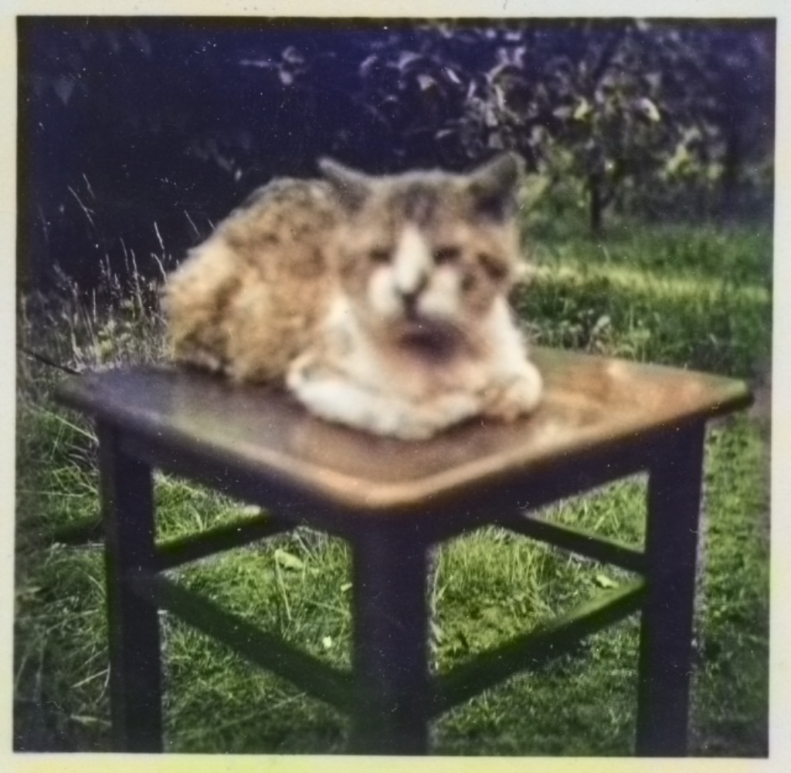

# Image Colorizer
Colorize and save your grayscale images using a trained Caffe deep learning framework.

# Installation 
1- Download the project  
2- Go to [this Google Drive link](https://drive.google.com/file/d/1iYMY64RGyamdcJWjhHrSgU-CkjmI-MbF/view?usp=sharing) and download the "Colorize-Image-Model.zip" file  
3- Extract the "Colorize-Image-Model.zip" file inside the "Model" directory  

# Examples

